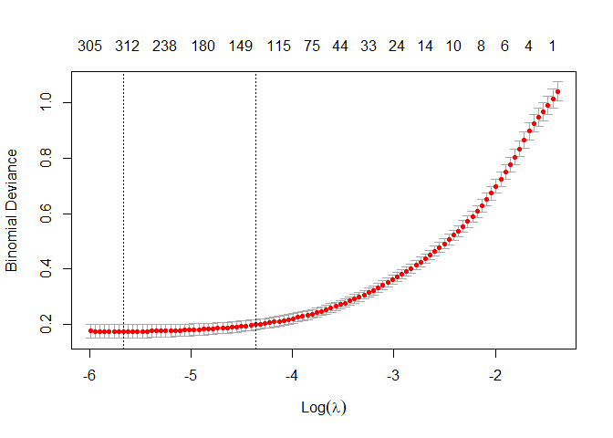

<!-- README.md is generated from README.Rmd. Please edit that file -->

# abstractsHostParasites

<!-- badges: start -->
<!-- badges: end -->

The goal of this R package abstractsHostParasites is to hold tools for
generate text classification models and process data associated with
this task.

## Installation

You can install the development version of abstractsHostParasites from
[GitHub](https://github.com/) with:

``` r
# install.packages("devtools")
devtools::install_github("alrobles/abstractsHostParasites")
```

## Acplication case

The main goals of this project is to have a model that given an abstract
can classify if this abstrac belongs to a specific category.

An application case is to consider articles related to host-parasite
interactions from open databases. In we case we get refered citations in
[Zover](http://www.mgc.ac.cn/cgi-bin/ZOVER/main.cgi) and Glogal mammal
parasite database [GMPD](https://gmpd2.ecology.uga.edu/)

## Example

For this example we prepare two datasets, one with abstracts from ZOVER
database with host parasite interactions and other with random articles.

``` r
library(abstractsHostParasites)
library(tidyverse)
#> Warning: package 'tidyverse' was built under R version 4.1.3
#> -- Attaching packages --------------------------------------- tidyverse 1.3.1 --
#> v ggplot2 3.3.6     v purrr   0.3.4
#> v tibble  3.1.8     v dplyr   1.0.9
#> v tidyr   1.2.0     v stringr 1.4.0
#> v readr   2.1.2     v forcats 0.5.1
#> Warning: package 'ggplot2' was built under R version 4.1.3
#> Warning: package 'tibble' was built under R version 4.1.3
#> Warning: package 'tidyr' was built under R version 4.1.3
#> Warning: package 'readr' was built under R version 4.1.3
#> Warning: package 'dplyr' was built under R version 4.1.3
#> Warning: package 'forcats' was built under R version 4.1.3
#> -- Conflicts ------------------------------------------ tidyverse_conflicts() --
#> x dplyr::filter() masks stats::filter()
#> x dplyr::lag()    masks stats::lag()

df_abstracts_zover <- readr::read_csv("https://raw.githubusercontent.com/alrobles/abstractsHostParasites/main/data-raw/zover_doi_abstract_date.csv")
#> Rows: 348 Columns: 9
#> -- Column specification --------------------------------------------------------
#> Delimiter: ","
#> chr (6): doi, title, abstract, month, date, source
#> dbl (2): id, year
#> lgl (1): -
#> 
#> i Use `spec()` to retrieve the full column specification for this data.
#> i Specify the column types or set `show_col_types = FALSE` to quiet this message.

df_abstracts_random <- readr::read_csv("https://raw.githubusercontent.com/alrobles/abstractsHostParasites/main/data-raw/df_abstracts_random.csv")
#> Rows: 4256 Columns: 5
#> -- Column specification --------------------------------------------------------
#> Delimiter: ","
#> chr (5): doi, title, abstract, class, language
#> 
#> i Use `spec()` to retrieve the full column specification for this data.
#> i Specify the column types or set `show_col_types = FALSE` to quiet this message.
```

We join together this data sets and prepare for modelling. We add a
class in each case. We set parasite class for zover abstracts and
unknown class for random abstracts. With do this with the help of
`dplyr` functions

``` r
df_abstracts_zover <- df_abstracts_zover %>% 
  select(doi, title, abstract) %>% 
  mutate(class = "parasite")

df_abstracts_random <- df_abstracts_random %>%
  sample_n(1000) %>% 
  select(doi, title, abstract) %>% 
  mutate(class = "unknown")

df_abstracts <- bind_rows(df_abstracts_zover, df_abstracts_random) %>%  
  sample_frac(1) %>% 
  na.exclude()
```

We finally use the `automodel_pu_abstracts` to classify this abstracts.

``` r
models <- df_abstracts %>% 
  automodel_pu_abstracts(term_count = 1,
                         split_prop = 0.85,
                         doc_prop_max = 0.9,
                         doc_prop_min = 0)
```

We plot the final model just to look how it is.

``` r
plot(models$model$fit.pi)
```


